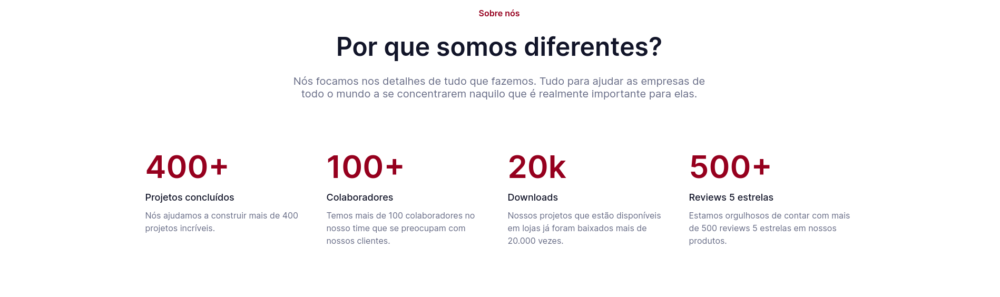
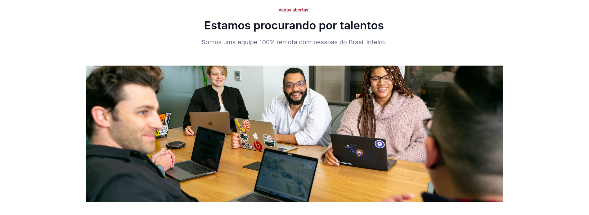
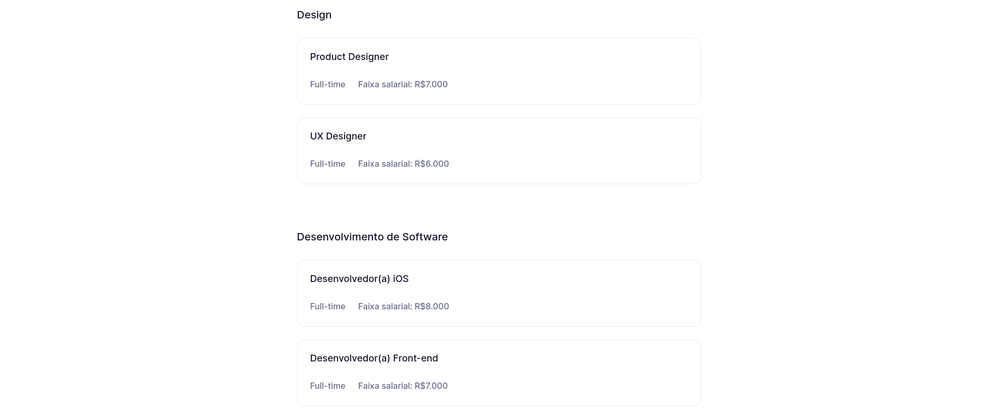
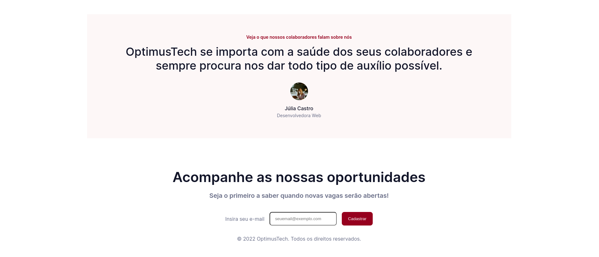

<h1>7DaysOfCode HTML e CSS - Alura</h1>
<h2> OptimusTech</h2>

    Este projeto foi desenvolvido durante os sete dias do 7DaysOfCode da Alura. O objetivo foi utilizar HTML e CSS para criar um site de vagas de emprego chamado OptimusTech.

<h3>Elementos construídos</h3>
<h4>Header</h4>

<h4>Seções "Sobre nós" e métricas</h4>

<h4>Conteúdo principal</h4>

<h4>Seção de depoimentos e footer</h4>

<h3>Tecnologias utilizadas</h3>
<ul>
    <li>HTML</li>
    <li>CSS</li>
    <li>JavaScript (Apenas para abrir e fechar o menu de navegação mobile)</li>
</ul>
